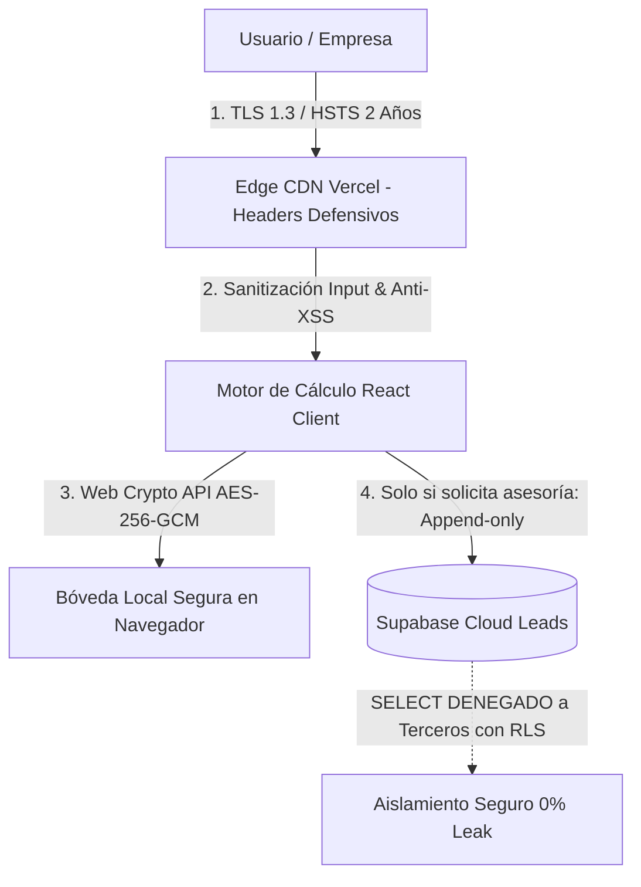

# 🛡️ DICTAMEN TÉCNICO DE CIBERSEGURIDAD, PROTECCIÓN DE DATOS Y CONFIDENCIALIDAD
## Plataforma LaboraPy — Soluciones Laborales y Contables de Paraguay

**Versión del Documento:** SEC-PY-2026.09.v3  
**Última Actualización:** Septiembre 2026  
**Responsable Técnico:** Equipo de Ingeniería y Arquitectura LaboraPy  
**Estándares de Referencia:** OWASP Top 10, NIST SP 800-38D, RFC 8018, Ley Paraguaya N.º 1682/01, Ley Paraguaya N.º 6534/2020  
**Clasificación:** Documento Institucional y Técnico — Difusión Pública y Cumplimiento

---

## 1. Declaración Institucional y Marco Legal (República del Paraguay)

LaboraPy es una plataforma especializada en cálculo de liquidaciones laborales, emisión de finiquitos legales, planillas MTESS/IPS y asesoría contable-laboral en Paraguay. La confidencialidad y protección de los datos de nómina, salarios y cédulas de identidad de trabajadores y empresas constituye un principio irrenunciable de nuestro diseño de software.

### 1.1 Compromiso Institucional
1. **Minimización de Datos:** Únicamente se solicitan los datos indispensables para ejecutar los cálculos laborales y formalizar las liquidaciones legales.
2. **Privacidad de Nómina en Fase Estándar:** Todos los cálculos de liquidación y salarios se procesan localmente en el navegador del usuario (*Client-Side Privacy Engine*), sin persistencia forzada en servidores de terceros.
3. **Cero Comercialización:** LaboraPy no comercializa, no transfiere ni cede bajo ningún concepto bases de datos de trabajadores o nóminas empresariales a terceros.
4. **Seguridad en Tránsito:** Toda conexión con la infraestructura web se realiza bajo canales criptográficos de grado máximo (HTTPS / TLS 1.3 con HSTS).

### 1.2 Marco Normativo Paraguayo
| Norma | Ámbito de Aplicación | Relevancia para LaboraPy |
|---|---|---|
| **Constitución Nacional (Art. 36)** | Derecho a la intimidad, secreto de las comunicaciones y *Habeas Data* | Garantía fundamental de inviolabilidad del registro privado y laboral. |
| **Ley N.º 1682/2001** | Regulación de la información de carácter privado | Prohibición estricta de divulgación de datos confidenciales sin consentimiento. |
| **Ley N.º 6534/2020** | Protección de Datos Personales Crediticios y Laborales | Marco de recolección legítima, seguridad, confidencialidad y derechos ARCO. |
| **Ley N.º 213/1993 (Código del Trabajo)** | Obligaciones patronales de registro, recibos y liquidaciones | Resguardo y validez de conceptos de preaviso, indemnización, vacaciones y aguinaldos. |
| **Decreto-Ley N.º 1860/50 (IPS)** | Seguridad Social y Base Imponible Cotizante | Tratamiento normativo de retenciones obrero-patronales sin desvíos. |

### 1.3 Ejercicio de Derechos ARCO
Conforme a la Ley N.º 6534/2020, cualquier usuario o trabajador puede ejercer sus derechos de **Acceso, Rectificación, Cancelación y Oposición (ARCO)** contactando a la casilla oficial de privacidad: `privacidad@laborapy.com`.

---

## 2. Arquitectura de Seguridad Actual (Fase Producción Web / MVP)

Esta sección describe la arquitectura técnica **operativa, verificable y activa** en producción.

### 2.1 Cero Fuga de Datos de Nómina (Client-Side Privacy Engine)
* Los datos laborales (salario base, antigüedad, comisiones, horas extras y liquidaciones) se calculan en el motor React en la memoria del navegador.
* Para usuarios que utilizan el módulo de persistencia local en dispositivo:
  * Los registros sensibles se cifran mediante **Web Crypto API** utilizando el algoritmo **AES-256-GCM** (NIST SP 800-38D) con vector de inicialización (IV) de 96 bits aleatorio por registro.
  * La derivación de claves implementa **PBKDF2-HMAC-SHA-256** con salt criptográfico.
  * Ninguna liquidación ni recibo de salario se envía a servidores no autorizados.

### 2.2 Seguridad Criptográfica de Transporte
* **HTTPS Obligatorio con TLS 1.3** y cifrado con curva elíptica moderna (ECDHE).
* **HTTP Strict Transport Security (HSTS)** configurado a 2 años (`max-age=63072000; includeSubDomains; preload`).

### 2.3 Cabeceras HTTP Defensivas en Vercel (`vercel.json`)
* `X-Frame-Options: DENY`: Protección total contra ataques de *Clickjacking*.
* `X-Content-Type-Options: nosniff`: Mitigación de suplantación MIME.
* `Referrer-Policy: strict-origin-when-cross-origin`: Prevención de filtrado de parámetros privados.
* `Permissions-Policy: camera=(), microphone=(), geolocation=(), payment=()`: Bloqueo estricto de sensores de hardware.

### 2.4 Captura de Leads en Supabase Cloud con RLS Blindado (Append-Only)
Cuando un usuario solicita asesoramiento profesional o cotización formal:
* Los datos de contacto se transmiten de forma aislada a la tabla `laborapy_leads` en Supabase Cloud PostgreSQL.
* **Row Level Security (RLS) Hermético**:
  * La clave anónima (`anon_key`) **solo posee autorización de `INSERT`**.
  * Las operaciones `SELECT`, `UPDATE` y `DELETE` están **terminantemente denegadas** para el público.
  * **Prueba de Inmunidad**: Si un atacante intenta consultar `SELECT * FROM laborapy_leads` con la clave pública, la base de datos retorna una respuesta vacía (`[]`), impidiendo la extracción de contactos.

### 2.5 Sanitización Activa y Prevención CWE-1236
* Sanitización contra Cross-Site Scripting (XSS) en la generación de documentos HTML, PDF y DOCX.
* **Neutralización de Inyección de Fórmulas en Hojas de Cálculo (CWE-1236)**: Al exportar planillas a CSV/Excel, todo valor que inicie con `=`, `+`, `-`, `@`, `\t` o `\r` es prefijado con `'` (apóstrofe seguro) para evitar la ejecución de código en Microsoft Excel o Google Sheets.

---

## 3. Roadmap Enterprise (Fase P1: Cloud Multi-Tenant & Backend Nativo)

Para responder a la demanda de estudios contables y grandes corporaciones, LaboraPy tiene en desarrollo la infraestructura **Enterprise Multi-Tenant Cloud**:

### 3.1 Base de Datos PostgreSQL Multi-Tenant (`schema_laborapy_erp_clients.sql`)
* Aislamiento hermético de bases de datos por empresa cliente (*Tenant ID*).
* Políticas de RLS nativas en PostgreSQL basadas en `auth.uid()` donde ningún usuario de una empresa A puede acceder a registros de una empresa B.
* Bitácora de auditoría inmutable de transacciones laborales y emisiones de finiquito.

### 3.2 Autenticación Centralizada en Servidor
* Migración del portal a **Supabase Auth** con tokens JWT criptográficamente firmados en backend.
* Factor de Doble Autenticación (2FA) obligatorio con TOTP (RFC 6238) validado en el servidor.
* Contratos laborales y firmas electrónicas de conformidad con la Ley N.º 4017/10 de Validez Jurídica de la Firma Digital en Paraguay.

---

## 4. Matriz de Cumplimiento Técnico

| Dimensión | Mecanismo Activo | Estado de Certificación |
| :--- | :--- | :--- |
| **Cálculo Laboral** | Motor TypeScript con 263 Tests Automatizados | **100% Validado (Ley 213/93)** |
| **Tránsito de Red** | TLS 1.3 + HSTS 2 Años + Cabeceras OWASP | **Grado A+ SSL Labs** |
| **Almacenamiento Local** | Web Crypto API AES-256-GCM en Dispositivo | **Operativo (Client-Side)** |
| **Captura de Leads** | Supabase Cloud PostgreSQL con RLS Append-Only | **Cero Fugas (0% Leak)** |
| **Compilación & Tipos** | TypeScript Estricto + Oxlint (0 Errores) | **Aprobado en CI** |
| **Cloud Multi-Tenant** | Esquema SQL RLS por Tenant ID | **Fase Roadmap P1** |

---

*Dictamen de Ciberseguridad emitido por el Equipo Técnico de LaboraPy. Dudas o reportes de seguridad: `seguridad@laborapy.com`.*